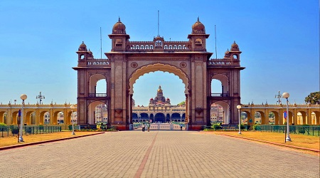

# assignment2-Nadendla
second assignment web apps 
# Sandeep Nadendla
## Pav bhaji
Pav bhaji is a popular street snack originating from the Indian state of Maharashtra. It consists of a vegetable curry that is typically served with a **soft bread** roll known as **pav**. The dish was invented in the 1850s as a midnight meal by street vendors who prepared it with all the leftover vegetables from the day, which were then mashed and combined with spices and ghee butter but today it is a **favorite street snack** that is also served in some restaurants

***

# Steps to book safe ride
1. Go to appstore or playstore and download and install **Tapride App**
2. Open Taperide App and select college Northwest missouri state university
3. Now select microsoft account for login
4. Login using studentid and password
5. check wheather safe rides are available
6. If availabe request ride and select pickup and drop location
* check wheather ride is confrimed and time slote
* wait at place where safe ride picks you 
* show your studentid in tapride app and process is done

[Click to know about me](https://github.com/sandeepnadendla-git/assignment2-Nadendla/blob/main/AboutMe.md)

***

# My recomendations places to visit

 ## 1. Golden Temple
Amritsar is in PunjabState and is the spiritual centre of the Sikh religion. It might be surprising that the GoldenTemple, the holy Sikh temple receives more visitors than the Taj Mahal. Built in the 16th Century, it is located in a beautiful and spectacular complex. When inside the GoldenTemple, one is well aware of the reverence paid to it by all visitors.

| Location | Spending Hours | Amount |
| --- | ----------- | ----- |
| Amritsar | 5  | 5000 |

. .

## 2. Mysore Palace
Mysore Palace, also called Amba Vilas Palace, is one of the most magnificent and largest palaces in India. Situated in the southern state of Karnataka, it used to be the official residence of the Wodeyar Dynasty, the rulers of Mysore from 1399 to 1950. The grand palace stands tall in the heart of Mysore city and attracts visitors from across the world. Being one of the prime attractions in India after the Taj Mahal, it certainly deserves a place in every traveler’s bucket list.

| Location | Spending Hours | Amount |
| --- | ----------- | ----- |
| Mysore | 4  | 1000 |

. .

## 3. Haridwar Temple
Haridwar is an ancient city situated in the Garhwal region of Uttarakhand on the banks of the holy river Ganga and is a land of legends and myths. It is considered to be one of the sacred places to visit in India and is the gateway to the Char Dham trek comprising Badrinath, Kedarnath, Gangotri, and Yamunotri. Beautifully nestled in the heart of Uttarakhand, the city houses popular temples and shrines.

| Location | Spending Hours | Amount |
| --- | ----------- | ----- |
| Himachal | 2  | 2000 |

. .

## 4. Chikmagalur  
Chikmagalur in Karnataka is an exciting hill station that exhibits the best form of green nature and pleasant environment letting everyone escape from the rambunctious noises of the city with the best Chikmagalur tourist places. Sightseeing and trekking have a prominent place in the tourism sector of this tiny town which is highly blessed by the mighty Western Ghats.

| Location | Spending Hours | Amount |
| --- | ----------- | ----- |
| Karnataka | 6  | 1000 |

. .

***
# Favourite quotes

> Arise,awake and donot stop until the goal is reached.
*Swami Vivekananda*

> If you have no critics, you’ll likely have no success.
*Malcolm X*

***

# About SQL

> SQL is Structured Query Language, which is a computer language for storing, manipulating and retrieving data stored in a relational database. SQL is the standard language for Relational Database System. All the Relational Database Management Systems (RDMS) like MySQL, MS Access, Oracle, Sybase, Informix, Postgres and SQL Server use SQL as their standard database language.

Quick link to sql <https://www.w3schools.com/sql/default.asp>

``` 
CREATE TABLE Persons (
    ID int NOT NULL PRIMARY KEY,
    LastName varchar(255) NOT NULL,
    FirstName varchar(255),
    Age int
);

```
Quick link to CODE <https://www.w3schools.com/sql/sql_primarykey.asp>


